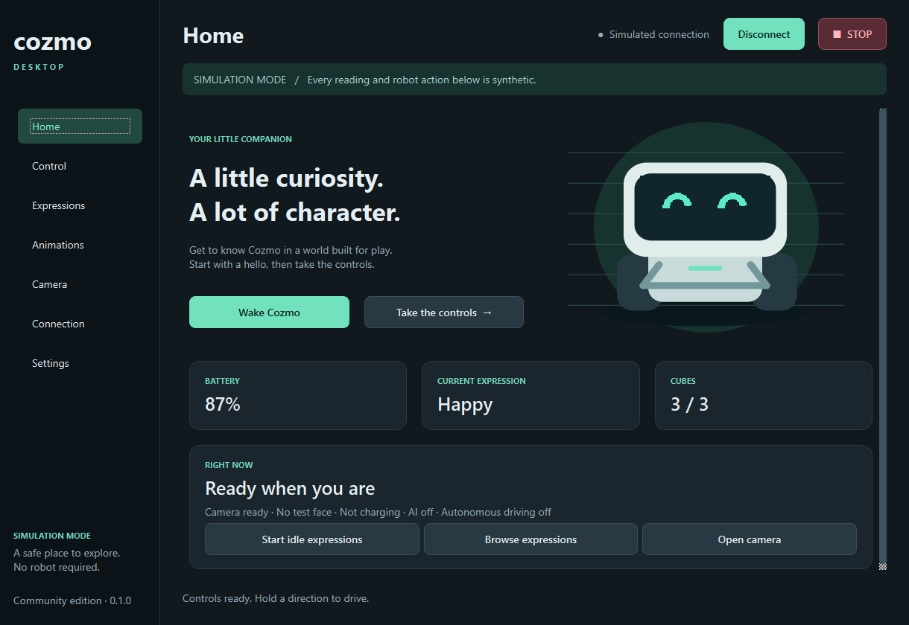

# Cozmo Desktop

A native, open-source desktop companion for Anki Cozmo, targeting PrimTux first and
Ubuntu second, with
Python and Qt. It brings controls, expressions, camera, personality, cube games and
local Ollama conversation together behind a hardware-independent interface.

**Primary platform: PrimTux. Secondary platform: Ubuntu. AI: local/offline Ollama.**
**Play · Talk · Code:** Cozmo Code Lab embeds the real open-source Scratch 3 editor
with 35 custom Cozmo blocks. It is an unofficial product, not affiliated with the
Scratch Foundation. See the [Scratch integration and licenses](docs/SCRATCH_INTEGRATION_PLAN.md).
The owner's exact PrimTux version and hardware are not yet inspected. See the
[PrimTux inventory](docs/PRIMTUX.md) and [compatibility matrix](docs/PLATFORM_COMPATIBILITY.md).

**Version 0.3.0 includes opt-in experimental direct Wi-Fi control of a physical Cozmo.**
It has automated tests, but **has not yet been validated on a real robot**.
Simulation remains the default; no phone or API key is needed.

**Ubuntu / VMware / USB-WLAN: [Einrichtung für deinen echten Cozmo](docs/DIRECT_CONNECTION.md).**
The setup script uses Python 3.12 even if Ubuntu ships Python 3.14.



*Actual application capture on Windows using native Qt. Linux CI also renders the
application; its captures are attached to each successful Actions run.*

## Features

- Native dark desktop workspace with Home, Control, Expressions, Animations,
  Camera, Connection, Cubes, Games, Conversation, Code and Settings.
- Cozmo Code Lab: real Scratch GUI/VM, standard blocks and `.sb3` open/save,
  custom Cozmo movement, face, speech, cube, event, sensor and optional AI blocks.
  The editor bundle and robot bridge run on loopback with no normal-use Internet
  dependency. Cozmo commands use the existing safety controller; the native STOP
  remains visible. Scratch hardware behavior has **not** been physically validated.
  Seven original [lesson projects](examples/scratch) open with Scratch's normal
  **File → Load from your computer** action.
- Connect/disconnect a simulated Cozmo; inspect battery, pose, wheels, head, lift,
  synthetic face/cube state and camera readiness.
- Hold graphical controls or WASD to drive. Head arrows and R/F lift controls.
- Conservative 40 mm/s default, 80 mm/s cap, expiring drive lease, stop on release,
  focus/navigation loss, errors and disconnect. Physical mode defaults to 20 mm/s,
  caps at 40 mm/s and requires explicit motor arming. STOP latches desktop controls.
- Nine original procedural expressions, four synthetic animations, search,
  favorites and local sequence save/load.
- Direct mode: local eSpeak NG speech through Cozmo’s speaker; simulator: text events.
- Direct mode: real grayscale camera, OLED faces and cube connection, colored LEDs,
  tap and movement events.
- Simulator: synthetic camera with test overlays. Both modes support PNG snapshots.
- Cancellable personality with moods, blinking, gaze and original vocalizations;
  cube-tap invitations; slow floor roaming requires explicit opt-in and motor
  arming. Table mode locks wheels.
- Original-code Quick Tap, Memory Match and Keepaway rule recreations using cube events.
  These do not contain the original mobile game's engine or assets.
- Local Ollama conversation with installed-model selection, bounded memory and
  validated safe expressions/reactions. Optional local Vosk push-to-talk for German
  and English; no model is installed or contacted automatically.
- Local settings and allowlisted diagnostic export; microphone is opt-in and offline.
- Bounded motor-locked cliff-sensor trace for supervised table-edge measurements.

## Current status and connection support

| Mode | Status | Phone required? |
| --- | --- | --- |
| Simulator | Implemented; automated backend/UI tests | No |
| SDK bridge | Researched; adapter not implemented | Yes, for this connection architecture |
| Direct Wi-Fi | Implemented, opt-in experimental; physical validation pending | No |

The direct adapter sends real robot commands through PyCozmo 0.8.0. It never falls
back to simulation on a connection error. The original SDK talks
to the engine in the mobile app. PyCozmo implements a different, direct protocol.
Read [connection research](docs/CONNECTION_RESEARCH.md) for pinned source evidence,
compatibility concerns, licensing boundaries and unresolved questions.

## Ubuntu requirements and installation

PrimTux source setup: `bash scripts/setup-primtux.sh`, then
`bash scripts/start-primtux.sh`. Inspect the target first with
`bash scripts/primtux-info.sh`; [installation details](docs/PRIMTUX.md).

Source/CI targets: Ubuntu 22.04 with Python 3.11, Ubuntu 24.04 with Python 3.12.
Ubuntu 22.04's default Python 3.10 is too old; provide a Python 3.11 interpreter or
use Ubuntu 24.04. Ubuntu 26.04/ARM have not been validated. Python 3.14 is unsupported.

On Ubuntu 24.04:

```bash
sudo apt update
sudo apt install git python3-venv libegl1 libopengl0 libxkbcommon-x11-0 \
  libxcb-cursor0 libxcb-icccm4 libxcb-image0 libxcb-keysyms1 \
  libxcb-render-util0 libxcb-xinerama0 fonts-dejavu-core

git clone https://github.com/brqfwvb5sr-afk/cozmo-desktop.git
cd cozmo-desktop
python3 -m venv .venv
source .venv/bin/activate
pip install -e ".[dev]"
python -m cozmo_desktop
```

The `cozmo-desktop` launcher is also available after installation. For physical control,
install the `[direct]` extra and eSpeak NG, or use `bash scripts/setup-ubuntu.sh`.
Start with `bash scripts/start-ubuntu.sh` or select Direct Wi-Fi under Connection.
See the [hardware instructions and limitations](docs/DIRECT_CONNECTION.md).

An Ubuntu 24.04 amd64 `.deb` recipe and installation smoke test are included in CI.
Download a successful build's `ubuntu-24.04-amd64-deb` artifact from
[GitHub Actions](https://github.com/brqfwvb5sr-afk/cozmo-desktop/actions), extract it,
then run:

```bash
sudo apt install ./cozmo-desktop_0.3.0_amd64.deb
```

This adds Cozmo Desktop to the application menu. These are development artifacts,
not signed stable releases. See [packaging](docs/PACKAGING.md) for local builds,
source obligations and supported versions. AppImage is planned.

## First connection and simulation mode

1. Launch the app. The persistent **Simulation Mode** banner identifies synthetic data.
2. Select **Connect simulator**, or **Wake Cozmo** on Home.
3. Open **Control**, hold a direction and release it to stop.
4. Adjust head/lift, enter text and select Speak; the simulated utterance appears below.
5. Try Expressions, play an animation, or open the synthetic Camera.
6. Select **STOP** to cancel all activity. Select **Resume controls** to unlock again.

| Key | Behavior on Control page |
| --- | --- |
| W / A / S / D | Hold to drive forward / left / back / right |
| Up / Down | Head angle |
| R / F | Lift up / down |
| Space | Emergency stop (outside text inputs; STOP button is always available) |

Typing in a text field cannot drive the robot. Moving focus to a text field, switching
pages or deactivating the window stops movement. The simulator independently stops
unrenewed wheel commands after 350 ms, checked every 50 ms. This is software simulation,
not a claim of a tested physical safety mechanism.

Home's Freeplay is an original personality service, not the original mobile app's
Freeplay engine. Its eyes and sounds can run while stationary. Slow self-directed
movement is available only after choosing **Clear floor**, enabling motors and
checking the separate movement option. Table mode does not permit wheel movement:
the cliff sensor has not been physically validated for edge safety. No docking or
face identification is implemented. Cube battery and orientation remain unknown.

## AI configuration and Cozmo.AI integration

The app starts without a model or API key. On **Talk with Cozmo**, select a model
already installed in local [Ollama](https://docs.ollama.com/linux), type a message
or use optional push-to-talk with a downloaded German/English Vosk model. The
conversation service calls only the configured loopback server; its validated reply
changes Cozmo's eyes and is spoken through his speaker in direct mode. AI wheel
commands are forbidden, and head/lift reactions respect existing arming/safety.
The simulator shows speech as text. See [Ollama setup](docs/OLLAMA.md).

Cozmo.AI was inspected before implementation. Its concepts informed the roadmap,
but no application code/assets were copied and its `main.py` is not launched.
Selenium chatbot scraping is replaced here by local Ollama conversation; Vosk is
an optional offline STT provider. No cloud service or API key is required.
See [integration status](docs/COZMO_AI_INTEGRATION.md).

## Local data and diagnostics

Settings and the saved sequence live under `$XDG_CONFIG_HOME/cozmo-desktop`, falling
back to `~/.config/cozmo-desktop`. Use `--config-dir PATH` for an isolated instance.
Snapshots default to `~/Pictures/Cozmo/`; change the folder in Settings.

Settings → Diagnostics → Export produces a small JSON report containing only
version, platform, connection and safety flags. Speech, paths, environment variables,
profile information and raw exceptions are excluded. Rotating structured logs record
operation names and error types, never provider response bodies or speech text.

## Development and checks

```bash
pytest -q
ruff check .
ruff format --check .
mypy src
python -m build
QT_QPA_PLATFORM=offscreen python -m cozmo_desktop \
  --config-dir /tmp/cozmo-test --smoke-test build/screenshots
```

See [architecture](docs/ARCHITECTURE.md), [development](docs/DEVELOPMENT.md),
[AGENTS.md](AGENTS.md) and [contributing](CONTRIBUTING.md). Tests require no robot.
Version 0.3.0 adds tests for the new personality, games and conversation paths. The
Windows unit/Qt suite, type checks and source build are run before publication;
see [GitHub Actions](https://github.com/brqfwvb5sr-afk/cozmo-desktop/actions) for
the Ubuntu results on the exact revision you download. Physical validation is pending.

## Roadmap

1. Hardware-validate the experimental direct adapter and record actual firmware results.
2. Supervised floor/edge measurements and cube-game timing on a physical Cozmo.
3. Add optional speech recognition, richer activities and safe voice commands.
4. Evaluate an optional modern SDK/phone bridge without proprietary assets.
5. Expand Ubuntu targets, AppImage packaging and release reproducibility.

The detailed [roadmap](docs/ROADMAP.md) distinguishes existing features from planned work.

## Troubleshooting

- **Qt xcb plugin fails to load:** install the Ubuntu libraries listed above and run
  in a desktop session. Use `QT_QPA_PLATFORM=offscreen` only for headless tests.
- **No physical robot detected:** select Direct Wi-Fi, attach the USB Wi-Fi adapter to
  Ubuntu, join Cozmo’s network and close the phone app. See DIRECT_CONNECTION.md.
- **Controls stay stopped:** select Resume controls; in direct mode also Enable motors
  on Connection after putting Cozmo on the floor. Reconnect after a connection failure.
- **Invalid settings:** the app keeps the original file, reports the issue and uses
  safe defaults. Correct it or save new settings explicitly.
- **No voice/audio:** simulator speech is text-only; direct TTS requires `espeak-ng`.
  Local conversation requires a running Ollama service and an installed model.
- **Snapshots fail:** choose a writable folder in Settings.
- **Windows offscreen screenshots have boxes instead of fonts:** use native Qt rendering.

## Credits, license and disclaimer

Inspired by the Cozmo community, [c64-dev/Cozmo.AI](https://github.com/c64-dev/Cozmo.AI),
the [Anki SDK](https://github.com/anki/cozmo-python-sdk), its c64-dev fork and
[PyCozmo](https://github.com/zayfod/pycozmo). See [third-party details](docs/THIRD_PARTY.md).

Copyright © 2026 Cozmo Desktop contributors. Licensed under
[GPL-3.0-or-later](LICENSE). No proprietary mobile graphics, fonts, sounds or animation
packs are distributed. Cozmo is a product name of its respective owners.

**Unofficial community project. Not affiliated with Anki or Digital Dream Labs.**
